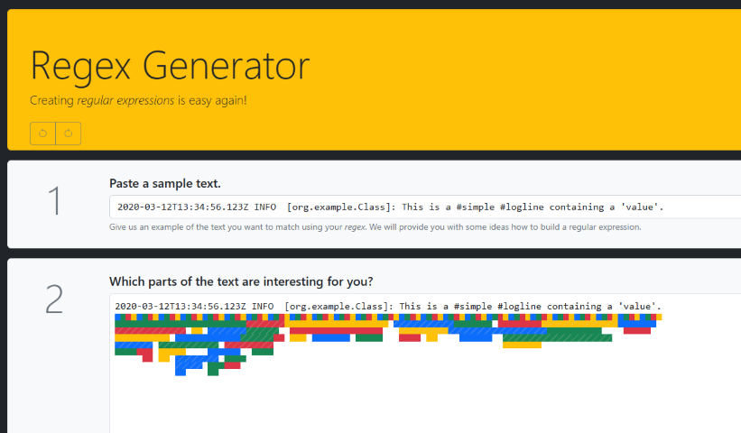
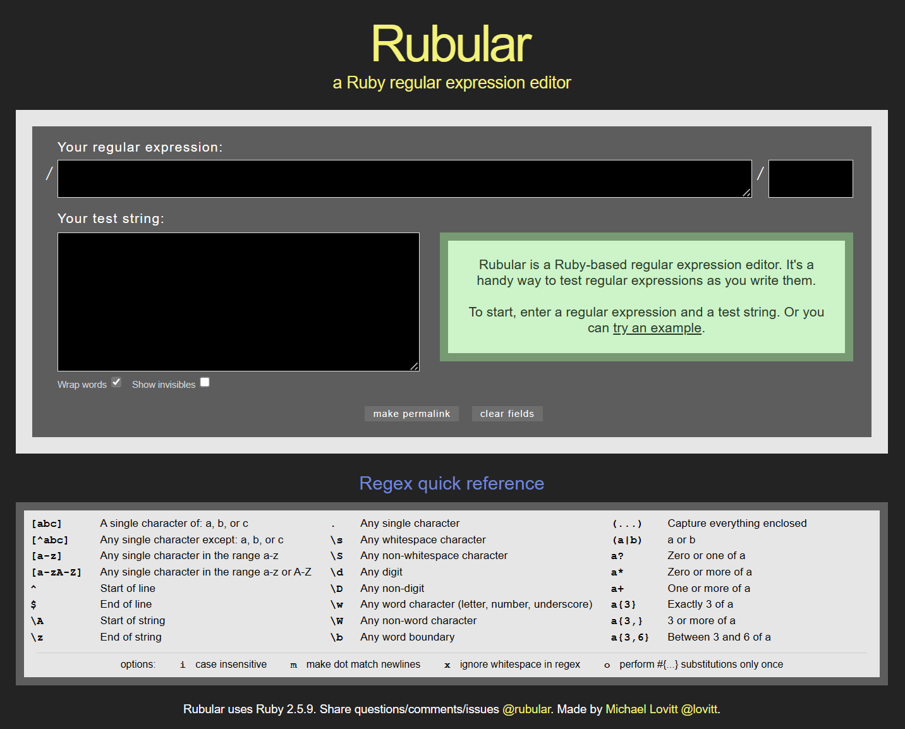
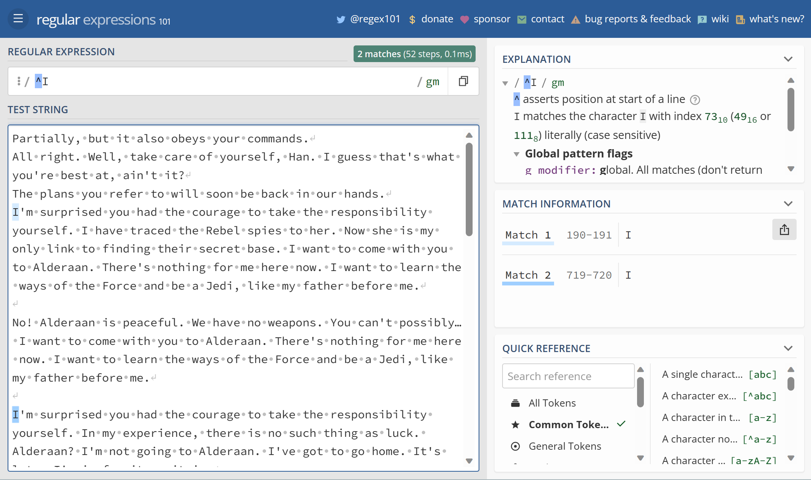

+++
categories = ['technology']
title = "Regex Resources"
slug = 'regex-resources'
date = 2023-04-10T20:38:09-05:00
tags = ['Regex']
draft = true
+++

Knowing how to use Regular Expressions (Regex) is a superpower.
You'll encounter Regex in lots of different technologies.
Most programming languages have some version of Regex built-in and many command-line tools allow you to use Regex patterns.
Even Visual Studio Code has a Regex pattern search option.

The major barrier to effective Regex is the strange pattern structure.
It takes time to develop the skill of crafting patterns with no outside help.
Writing a pattern usually requires a Regex tool.
These are my some of my favorite resources to help with creating patterns.

### Regex Generator

Give [Regex Generator](https://regex-generator.olafneumann.org/) the text, and it will give you possible regex patterns that match it.
The site provides a color coded set of patterns.
Hover over the pattern and then click to pick your pattern/match combination.
Code snippets for your pattern are available for many programming languages.

#### Rubular

The clean design of [Rubular](https://rubular.com/) makes it a good choice for testing and prototyping patterns.
The _Quick Reference_ section is clear and simple.
The permalink option is handy for sharing your pattern and test data with others.

#### Regex 101

[Regular Expressions 101](https://regex101.com/) is another excellent Regex validation site.
This site has more features than Rubular, but the _Quick Reference_ area isn't as easy to read.
There is an _Explanation_ section that describes your what your pattern will match.
The site provides detailed match information that can be exported.

### Pre-Built Regex Patterns

Grab prebuild Regex patterns from [Regex Pattern Site]().

### More Resources

If you are looking for more, this popular [awesome-regex](https://github.com/aloisdg/awesome-regex) repository on GitHub includes many prototyping sites and links for documentation and learning. 

