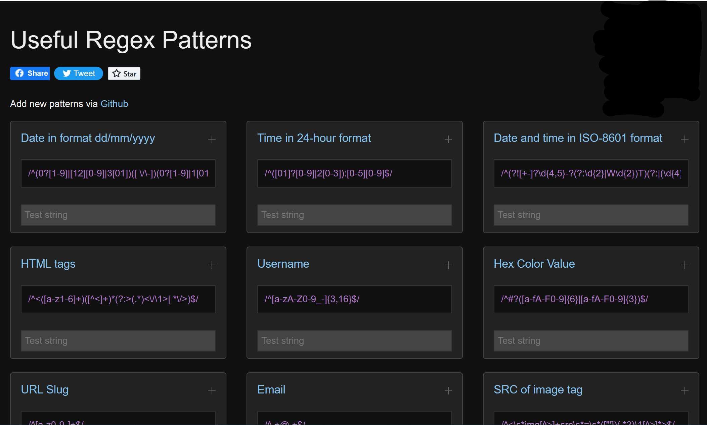

+++
categories = ['technology']
title = "Regex Resources"
description = "A short list of online resources for creating Regex patterns"
slug = 'regex-resources'
date = 2023-04-22T20:38:09-05:00
tags = ['Regex']
draft = true
+++

Knowing how to use Regular Expressions (Regex) to solve a technology problem is a superpower.
You'll encounter Regex in lots of different places.
Most programming languages have some version of Regex built-in and many command-line tools allow you to use Regex patterns.
Even Visual Studio Code has a Regex pattern search option.

Despite its power, developing Regex patterns requires mastering the strange pattern structure.
It takes time to develop the skill of crafting patterns with no outside help.
Writing a pattern usually requires a Regex tool.
These are my some of my favorite resources to help with creating patterns.

### Regex Generator

Give [Regex Generator](https://regex-generator.olafneumann.org/) the text, and it will give you possible regex patterns that match it.
The site provides a color coded set of patterns.
Hover over the pattern and then click to pick your pattern/match combination.
Code snippets for your pattern are available for many programming languages.

#### Rubular

The clean design of [Rubular](https://rubular.com/) makes it a good choice for testing and prototyping patterns.
The _Quick Reference_ section is clear and simple.
The permalink option is handy for sharing your pattern and test data with others.

#### Regex 101

[Regular Expressions 101](https://regex101.com/) is another excellent Regex validation site.
It has more features than Rubular, but the _Quick Reference_ area isn't as easy to read.
There is an _Explanation_ section that describes your what your pattern will match.
The site provides detailed match information that can be exported.

### Pre-Built Regex Patterns from Regexhub

Occasionally, you are trying to match a common data pattern, like a phone number or an IPv4 address.
The [regexhub project](https://projects.lukehaas.me/regexhub/) is a collection of common patterns based on GitHub contributions.
Some examples of the patterns on regexhub:

+ Email address
+ Dates & Times
+ URL
+ Zipcodes
+ HTML Tags

### More Resources

If you are searching for more help, this popular [awesome-regex](https://github.com/aloisdg/awesome-regex) repository on GitHub includes many prototyping sites and links for documentation and learning. 
